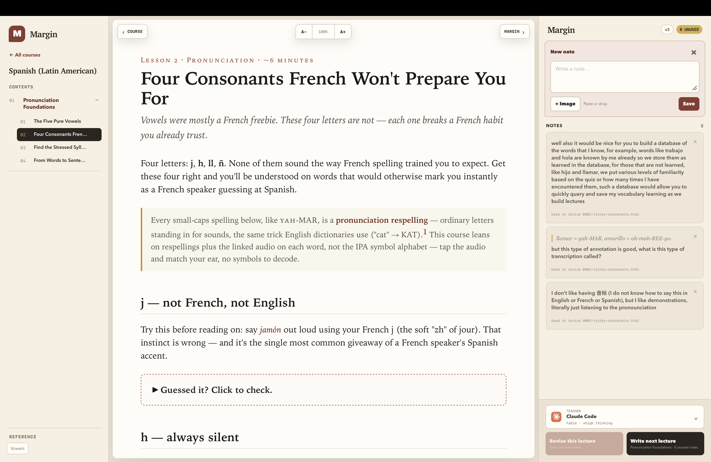
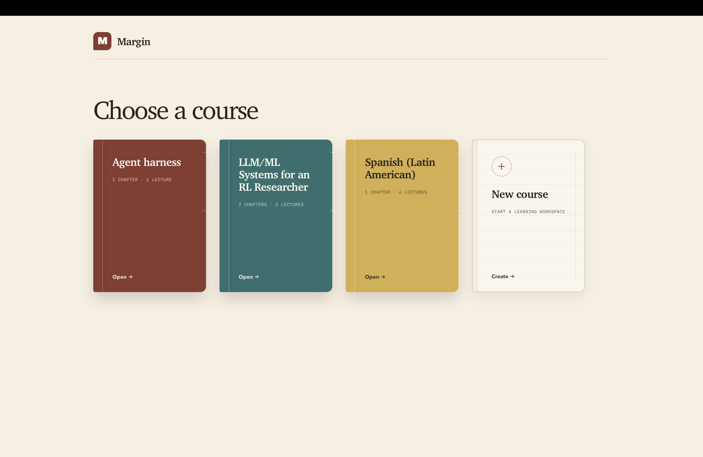
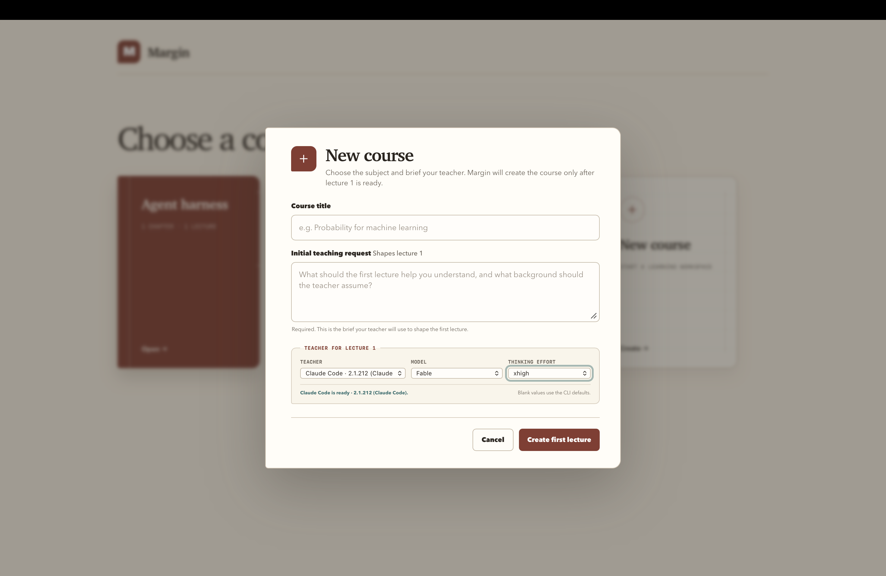

# Margin

Margin is a local, agentic learning app for macOS. Read short HTML lectures,
select any passage, leave text or image notes in the margin, and explicitly ask
Claude Code or Codex to revise the lecture or write the next lecture in its
chapter.

Learning and teaching are asynchronous. Reading never starts a background
agent, and leaving a note never claims that something was learned. A teacher
runs only when you click a teaching action.



<p>
  
  
</p>

> **Developer beta:** Margin 0.1.1 is an unsigned, Apple Silicon-only build for
> macOS 13 or newer. Expect rough edges and read the permissions section before
> using a teacher.

## What it does

- Organizes local courses into chapters and lectures.
- Creates a real first lecture from a teaching brief instead of a placeholder.
- Renders self-contained HTML lectures in a warm native macOS interface.
- Anchors text and image notes to lecture passages.
- Supports Claude Code and Codex, including model and reasoning-effort choices.
- Runs teacher work in the background while the library remains usable.
- Keeps that work alive across a WebView reload or activity-stream disconnect;
  only an explicit cancellation, app quit, or library change stops it.
- Tracks content-addressed lecture versions and supports restoration.
- Deletes courses and lectures recoverably into library or course-local trash.
- Commits each teaching action transactionally across the lecture and any
  supporting course-local data, with crash recovery for unfinished actions.
- Reconciles interrupted responses through durable operation receipts so a
  retry cannot silently duplicate a course or next lecture.
- Lets teachers build course-local learner models and utilities for durable
  state such as vocabulary, concepts, reading progress, and retrieval evidence.
- Guides teachers to use accessible SVG, animation, and interactive exercises
  when they materially improve an explanation.
- Keeps courses as ordinary HTML, Markdown, JSON, JavaScript, CSS, and image
  files that remain useful without Margin.

## Install the GitHub beta

1. Download `Margin-0.1.1-macos-arm64.zip` and `SHA256SUMS` from the latest
   GitHub Release.
2. Optionally verify the download:

   ```sh
   shasum -a 256 -c SHA256SUMS
   ```

3. Unzip Margin and move `Margin.app` to `/Applications`.
4. Try to open Margin once. Because this beta is not notarized, macOS will
   block the first launch.
5. Open **System Settings → Privacy & Security**, scroll to Security, choose
   **Open Anyway**, and confirm.

Apple documents this one-time override in
[Open a Mac app from an unknown developer](https://support.apple.com/guide/mac-help/open-a-mac-app-from-an-unknown-developer-mh40616/mac).
Do not bypass Gatekeeper for a binary whose source or checksum you do not trust.

On first launch, choose or create a learning-library folder. Margin remembers
the folder and can change it later from the application menu.

Only one Margin app can open a given learning library at a time. If you are
testing the release beside Margin Dev, quit Margin Dev before opening the same
library, or choose a different library. This lock prevents two teacher actions
from changing the same course concurrently.

## Teachers

Margin does not bundle an AI service. Install and authenticate at least one
supported command-line teacher:

- [Claude Code](https://docs.anthropic.com/en/docs/claude-code/overview)
- [Codex CLI](https://github.com/openai/codex)

Margin discovers installed CLIs, their compatible models, authentication
state, and supported reasoning efforts. Checking for an available update does
not update anything; running `claude update` or `codex update` remains an
explicit button action.

Teaching actions enable the selected CLI's live source-search capability so a
lecture can cite material it actually checked. Network requests and provider
retention remain governed by the selected CLI and provider.

### Filesystem permission

When you start a teaching action, the selected CLI receives write access to the
entire learning library you chose, not just the visible lecture. This is
intentional: a teacher may update directly requested supporting course state
such as vocabulary databases, notes, learning records, references, assets, or
resource lists, and may build course-local or library-level utilities in service
of long-term teaching. The teaching action is centered on the selected course.
Margin verifies its strict lecture invariant, protects app-owned `COURSE.json`
and `.learn/` history, and transactionally restores changes made to any other
recognized course directory it can safely snapshot. If a course contains an
unsafe or unreadable entry, Margin reports that the course was skipped instead
of blocking an unrelated teaching action. If a protected course changes while
the teacher runs, Margin restores the snapshot and preserves the displaced copy
under `.margin-trash/guard-conflicts/` so concurrent edits are recoverable.

Library-level utilities are intentionally outside the recognized-course guard.
They are allowed because the teacher has full write access within the selected
learning root; keep durable course-specific state inside its course directory
when you want transactional restoration.

Closing or reloading the reader does not cancel a teacher. Margin reconnects to
the durable operation receipt and keeps showing a background spinner. The
Cancel button requests rollback explicitly. If the local service stays
unreachable for a minute, Margin stops the spinner, keeps the receipt, and asks
you to restart so it can check the result. Quitting, restarting, or changing the
library while a teacher is active asks for confirmation first.

Use a dedicated learning-library folder. Do not select a directory containing
unrelated private or valuable files.

The provider CLI is a separate developer tool, not a container managed by
Margin. Margin limits the write paths it requests to the selected learning
library, but the CLI process and its own tools may still be able to read other
files your macOS account can read. Generated lecture isolation protects the app
interface; it does not sandbox Claude Code or Codex. Only run teachers on course
material you trust, and review the selected CLI's permissions and privacy terms.

## Course format

Each course is a directory containing `MISSION.md`, `COURSE.json`, `lessons/`,
and related optional material. See [docs/course-format.md](docs/course-format.md)
and [examples/demo-course](examples/demo-course) for a complete minimal course.

Margin stores annotations and lecture history under each course's ignored
`.learn/` directory. Those files are learner data, not application source.

Deleting is recoverable. A deleted course moves into `.margin-trash/` inside
the selected library. A deleted lecture is removed from `COURSE.json` and
archived with its margin notes and deletion version under the course's private
`.learn/trash/` directory. Margin will not delete the final lecture in a course;
delete the course instead.

## Development

Requirements:

- macOS 13 or newer
- Xcode Command Line Tools
- Node.js 20 or newer for development and tests
- `rsvg-convert` from librsvg, or ImageMagick, for the application icon

Run the browser development server against the current directory:

```sh
npm run dev
```

Build `Margin Dev.app`, a clearly labeled local shell that loads the backend,
interface, and teach skill directly from this checkout whenever it starts:

```sh
npm run build:dev
```

The development bundle intentionally records this checkout's absolute path and
the absolute `node` executable used to build it. At startup it prefers that
recorded executable, then falls back to searching a safe `PATH` if the recorded
path is no longer valid. It is for local iteration only and is never included in
release archives. Its preferences and logs use separate `Margin Dev`
directories. A shared library lock prevents Margin Dev and a release build from
mutating the same learning library concurrently.

Run the test suite:

```sh
npm test
```

Build the relocatable application:

```sh
npm run build:app
```

Create the unsigned GitHub release ZIP and checksum:

```sh
npm run package
```

The packaging script downloads and verifies a pinned official Apple Silicon
Node.js runtime. Set `MARGIN_NODE_RUNTIME=/absolute/path/to/node-distribution`
to use an already downloaded official distribution while developing offline.

## Architecture

Margin deliberately uses a small stack:

- Objective-C, Cocoa, and WKWebView for the native window and lifecycle
- plain HTML, CSS, and browser JavaScript for the interface
- a dependency-free Node.js HTTP service for course files and teacher processes
- external Claude Code and Codex subprocesses for explicit teaching actions

The installed app is read-only. Courses live in the user-selected library. The
app service binds only to loopback, uses a fresh authenticated session, and
renders mutable lecture HTML on an isolated origin.

## Local data and privacy

Margin has no account, telemetry, analytics, or hosted backend. See
[PRIVACY.md](PRIVACY.md) for the important distinction between Margin's local
storage and the external provider selected through Claude Code or Codex.

Default local state:

- course data and `.learn/` history: inside the selected learning library
- UI preferences: `~/Library/Application Support/Margin/`
- bounded service logs: `~/Library/Logs/Margin/`

## Contributing and security

See [CONTRIBUTING.md](CONTRIBUTING.md) for development expectations and
[SECURITY.md](SECURITY.md) for private vulnerability reporting. The project is
available under the [MIT License](LICENSE); bundled third-party notices are in
[THIRD_PARTY_NOTICES.md](THIRD_PARTY_NOTICES.md).
